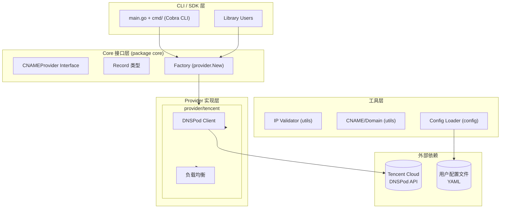
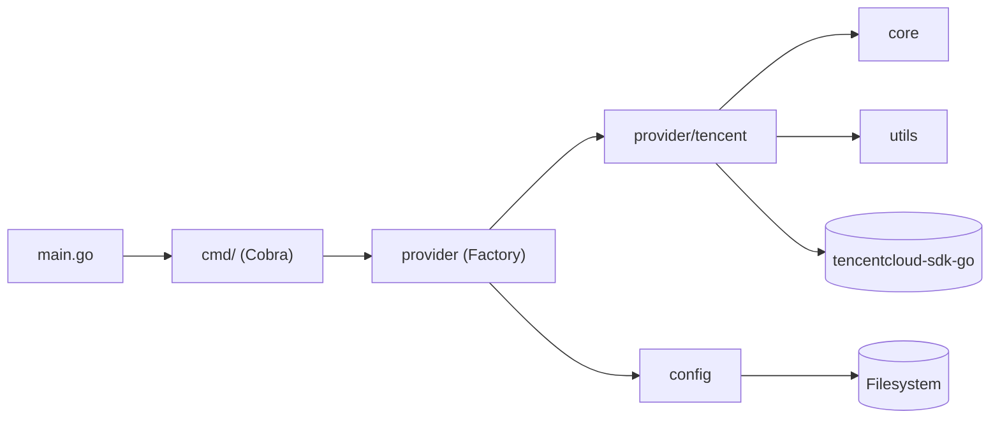

# GADNS

基于腾讯云 DNSPod 的 DNS 负载均衡工具，根据 IP 集合生成 CNAME 记录，支持多种 IP 格式。

## 特性

- 负载均衡模式：多IP按权重自动分配
- 接口与实现解耦，易于扩展
- 提供完整的命令行工具（基于 Cobra）
- 严格格式校验，完整测试覆盖

## 安装

### 作为库使用

```bash
go get github.com/wangbo2295/gadns
```

### 安装命令行工具

```bash
make build
sudo cp bin/gadns /usr/local/bin/
```

## 命令行工具使用

### 配置文件 (`~/.gadns/tencent.yaml`)

```yaml
secret_id: "your_secret_id"
secret_key: "your_secret_key"
region: "ap-guangzhou"
domain: "example.com"
```

### 命令示例

```bash
# 新增记录
gadns add -i 1.1.1.1 app

# 多个 IP（负载均衡，各 50% 权重）
gadns add -i 1.1.1.1,2.2.2.2 web

# 查询记录
gadns get app

# 列出所有记录
gadns list

# 更新记录
gadns update -i 5.5.5.5 app

# 删除记录
gadns delete app

# 使用自定义配置
gadns add -i 1.1.1.1 -c /path/to/config.yaml app

# 使用 Noop Provider（内网测试，无需腾讯云）
gadns -p noop -c noop.yaml add -i 1.1.1.1 app
```

## SDK 使用

### 方式一：工厂函数 + YAML 配置

```go
package main

import (
    "fmt"
    "github.com/wangbo2295/gadns/provider"
)

func main() {
    cp, err := provider.New("tencent", "~/.gadns/tencent.yaml")
    if err != nil {
        panic(err)
    }

    record, err := cp.Create("app.example.com", []string{"1.1.1.1", "2.2.2.2"})
    if err != nil {
        panic(err)
    }

    fmt.Printf("Name:  %s\n", record.Name)
    fmt.Printf("CNAME: %s\n", record.CNAME)
    fmt.Printf("IPs:   %v\n", record.IPs)
}
```

### 方式二：程序化配置（无需 YAML 文件）

```go
package main

import (
    "fmt"
    "github.com/wangbo2295/gadns/provider/tencent"
)

func main() {
    cp, err := tencent.NewProvider(&tencent.Config{
        SecretID:  "your_secret_id",
        SecretKey: "your_secret_key",
        Region:    "ap-guangzhou",
        Domain:    "example.com",
    })
    if err != nil {
        panic(err)
    }

    record, _ := cp.Create("app.example.com", []string{"1.1.1.1", "2.2.2.2"})
    fmt.Printf("CNAME: %s\n", record.CNAME)
}
```

### CNAMEProvider 接口

```go
type CNAMEProvider interface {
    Create(fullDomain string, ips []string) (*Record, error)
    Update(fullDomain string, ips []string) (*Record, error)
    Get(fullDomain string) (*Record, error)
    List() ([]*Record, error)
    Delete(fullDomain string) error
}
```

| 方法 | 说明 |
|------|------|
| `Create` | 创建域名到 IP 的映射。单 IP 创建一条 A 记录；多 IP 创建多条带权重的 A 记录。失败时自动回滚 |
| `Update` | 删除旧记录后重新创建，等价于 Delete + Create |
| `Get` | 查询指定域名的记录，返回聚合后的 IP 列表 |
| `List` | 列出所有 A 记录，按域名聚合 |
| `Delete` | 删除指定域名的所有关联记录 |

`fullDomain` 为完整域名（如 `app.example.com`），内部自动提取子域名调用 DNSPod API。

### utils 工具函数

```go
import "github.com/wangbo2295/gadns/utils"
```

| 函数 | 说明 | 示例 |
|------|------|------|
| `ValidateIP(ip string) error` | 校验 IPv4 地址 | `1.1.1.1` |
| `SubDomain(full, zone string) string` | 提取子域名 | `SubDomain("app.doerhh.cn", "doerhh.cn")` → `"app"` |
| `FullDomain(sub, zone string) string` | 构造完整域名 | `FullDomain("app", "doerhh.cn")` → `"app.doerhh.cn"` |
| `GenerateCNAME(full, zone string) string` | 生成 CNAME | `GenerateCNAME("app.doerhh.cn", "doerhh.cn")` → `"app-a1b2c3.doerhh.cn"` |

### 扩展自定义 Provider

实现 `core.CNAMEProvider` 接口即可接入新的 DNS 服务商：

```go
import "github.com/wangbo2295/gadns/core"

type MyProvider struct { /* ... */ }

func (p *MyProvider) Create(name string, ips []string) (*core.Record, error) { /* ... */ }
func (p *MyProvider) Update(name string, ips []string) (*core.Record, error) { /* ... */ }
func (p *MyProvider) Get(name string) (*core.Record, error)    { /* ... */ }
func (p *MyProvider) List() ([]*core.Record, error)            { /* ... */ }
func (p *MyProvider) Delete(name string) error                 { /* ... */ }
```

### Noop Provider（内网测试）

Noop Provider 行为与腾讯云完全一致（相同 CNAME 生成、IP 校验），数据存内存，无需联网：

```go
import "github.com/wangbo2295/gadns/provider/noop"

cp := noop.NewProvider(&noop.Config{Domain: "example.com"})

// 以下调用与 tencent provider 完全相同
record, _ := cp.Create("app.example.com", []string{"1.1.1.1", "2.2.2.2"})
cp.Get("app.example.com")
cp.List()
cp.Update("app.example.com", []string{"3.3.3.3"})
cp.Delete("app.example.com")
```

CLI 中使用 `-p noop`：

```bash
cat > noop.yaml << EOF
domain: "example.com"
EOF
gadns -p noop -c noop.yaml add -i 1.1.1.1 app
```

## IP 格式

每个 IP 必须是合法的 IPv4 地址，多个 IP 用逗号分隔。

## 接口

```go
type CNAMEProvider interface {
    Create(name string, ips []string) (*Record, error)
    Update(name string, ips []string) (*Record, error)
    Get(name string) (*Record, error)
    List() ([]*Record, error)
    Delete(name string) error
}

type Record struct {
    Name  string   // 完整域名
    CNAME string   // 生成的 CNAME
    IPs   []string // 原始 IP 列表
}
```

## 架构设计

### 系统架构



### 模块依赖关系



## 项目结构

```
gadns/
├── main.go              # CLI 入口 (package main)
├── cmd/                 # Cobra 命令定义
│   ├── root.go          # 根命令、版本信息
│   ├── add.go           # add 子命令
│   ├── update.go        # update 子命令
│   ├── get.go           # get 子命令
│   ├── list.go          # list 子命令
│   └── delete.go        # delete 子命令
├── core/                # 核心接口和类型 (package core)
│   ├── cname.go         # CNAMEProvider 接口、Record 类型
│   └── cname_test.go
├── provider/            # Provider 实现
│   ├── factory.go       # 工厂函数
│   ├── tencent/         # 腾讯云实现
│   │   ├── provider.go  # CNAMEProvider 实现
│   │   ├── client.go    # DNSPod API 封装
│   │   └── config.go    # 配置类型
│   └── noop/            # 内网测试实现（内存存储）
├── utils/              # 工具函数 (package utils)
│   ├── validator.go     # IPv4 校验
│   └── domain.go        # 域名处理、CNAME 生成
├── config/              # 配置加载 (package config)
│   └── loader.go        # YAML 配置加载
├── examples/            # 使用示例
│   └── tencent/main.go
├── Makefile
└── README.md
```

## 负载均衡

当传入多个 IP 时，系统为每个 IP 创建一条独立的 A 记录并分配权重：

- 2 个 IP：各 50%
- 3 个 IP：各 33%
- 4 个 IP：各 25%

单一 IP 时直接创建一条默认记录，不设置权重。

## 示例

```bash
# 腾讯云 Provider 示例
go run examples/tencent/main.go
```

## 测试

```bash
# 运行所有测试
go test ./...

# 查看测试覆盖率
go test -cover ./...
```

## 开发

```bash
go mod tidy
go fmt ./...
go vet ./...
```

## License

MIT
